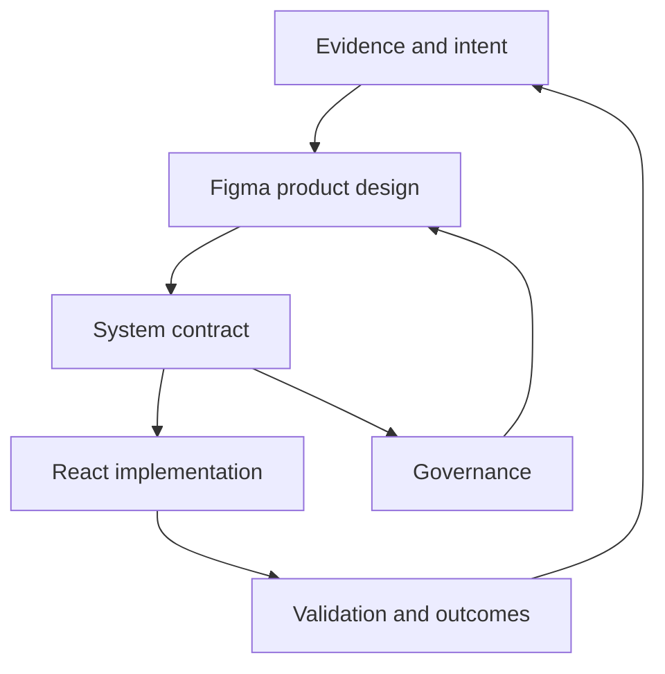

# Design Code Intelligence

Design Code Intelligence is an open-source operating layer for evidence-led product design in Codex Work. It connects research, Figma, design systems, accessible React implementation, responsible AI and leadership communication through a focused set of reusable skills.

## Why it exists

Product design often fragments across research documents, design files, component libraries, code and governance forums. The result is avoidable translation loss: decisions lose their evidence, Figma drifts from production, accessibility arrives late and AI controls remain disconnected from the experience.

Design Code Intelligence keeps those concerns connected from intent to implementation.

## Included skills

| Skill | Purpose |
| --- | --- |
| `evidence-led-design` | Connect observations, insights, opportunities, decisions and measurable outcomes. |
| `figma-product-design` | Create production-minded screens, flows, components and token foundations. |
| `react-frontend` | Build accessible, reusable React interfaces from requirements or Figma. |
| `design-system-governance` | Govern tokens, components, contribution, parity and adoption. |
| `responsible-ai-product` | Design accountable human–AI experiences across experience, operations and governance. |
| `stakeholder-briefing` | Turn complex work into concise senior decision briefs. |
| `case-study-storytelling` | Shape credible portfolio, CV, interview and leadership narratives. |

## Operating model



The system contract links component purpose, variants, states, semantic tokens, responsive behaviour and accessibility expectations across design and code.

## Installation

Clone the repository into a local Codex plugin directory:

```bash
git clone https://github.com/mariaIQ/Design-Code-Intelligence.git
```

The repository includes a valid `.codex-plugin/plugin.json` manifest and skills under `skills/`. Register the local plugin through your Codex plugin marketplace or plugin settings, then begin a new conversation so the skills are discovered.

## Example prompts

```text
Turn this product requirement into an evidence-led Figma flow and define the React component contract.
```

```text
Review this AI-assisted underwriting journey across experience, operations and governance.
```

```text
Assess parity between these Figma variants and the React component states, including accessibility gaps.
```

## Principles

- Evidence before theatre.
- Accessibility is part of the interaction contract.
- Figma and code parity must be verified, not assumed.
- AI decisions require human, operational and governance controls.
- Design systems are products and organisational capabilities.
- Outcomes must remain traceable to decisions.

## Contributing

Issues and focused pull requests are welcome. See [CONTRIBUTING.md](CONTRIBUTING.md) for the contribution standard.

## Licence

Released under the [MIT Licence](LICENSE).
